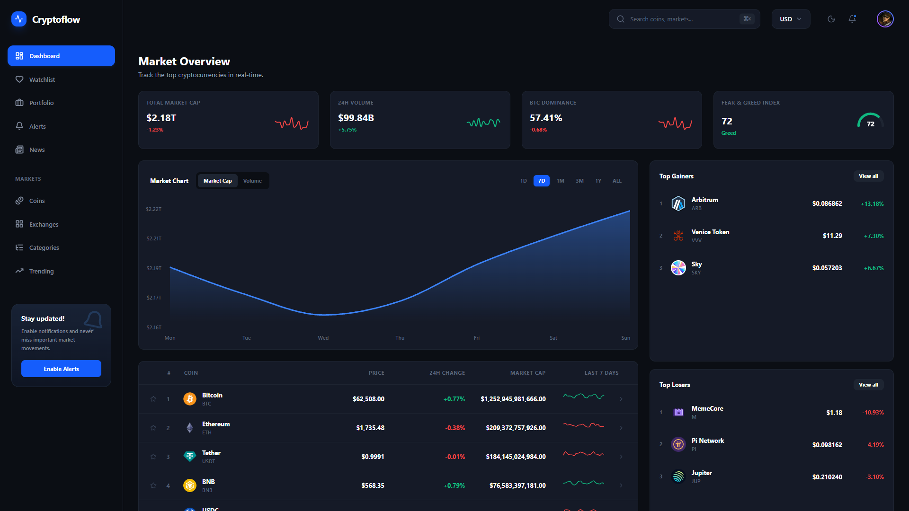
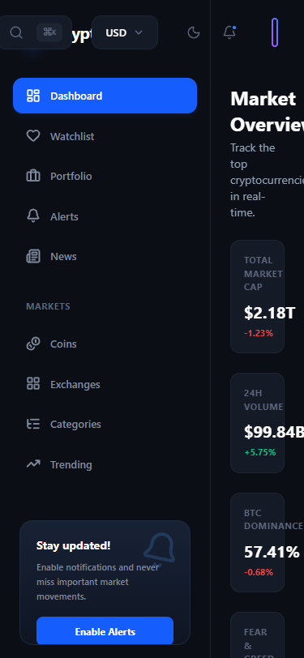

# CryptoFlow Dashboard

Dashboard interactivo y de alto rendimiento para el seguimiento de criptomonedas, con datos en tiempo real y gestión de estado avanzado.

Diseñé y desarrollé este proyecto para simular un entorno real de finanzas (tipo broker), centrándome en la mitigación de límites de API, cacheo agresivo y una experiencia de usuario fluida con gráficos dinámicos.

## Vista General

CryptoFlow Dashboard presenta el top 100 de criptomonedas, gráficos de rendimiento, un mapa de calor del mercado y una lista de favoritos. La página está pensada para transmitir la sensación de un terminal financiero profesional, ofreciendo datos inmediatos sin latencia perceptible gracias a estrategias avanzadas de fetching y estado global.

## Funcionalidades

- Conexión con la API de CoinGecko para datos reales del mercado.
- Mitigación inteligente de rate-limit (60s polling).
- Motor de simulación en tiempo real para dar sensación de mercado vivo.
- Watchlist persistente utilizando estado global para guardar criptomonedas favoritas.
- Búsqueda instantánea con filtrado en el cliente (cero latencia).
- Gráficos interactivos y responsivos para análisis de precios.
- Diseño responsive para desktop, tablet y móvil.

## Tecnologías

- React
- TypeScript
- Tailwind CSS
- Zustand
- TanStack Query
- Recharts
- Vite

## Decisiones de Implementación

El proyecto está construido con React y Vite para garantizar una carga rápida y tipado estricto con TypeScript. Elegí Zustand para el estado global por su ligereza y facilidad para persistir la Watchlist en el navegador.

Para la obtención de datos, utilicé TanStack Query. Dado que las APIs financieras gratuitas tienen límites estrictos (HTTP 429), configuré un caché agresivo y un polling controlado cada 60 segundos. 

Para mantener la aplicación visualmente activa sin agotar la API, implementé una lógica personalizada que aplica fluctuaciones microscópicas a los precios cacheados localmente. Esto simula transacciones de alta frecuencia sin hacer peticiones de red reales.

## Estructura

```txt
07-crypto-dashboard/
├── README.md
├── index.html
├── package.json
├── screenshots/
└── src/
    ├── components/
    │   ├── dashboard/
    │   └── layout/
    ├── pages/
    ├── services/
    ├── store/
    ├── App.tsx
    └── main.tsx
```

## Cómo Ejecutarlo

No requiere configuración compleja, pero necesita Node.js.

1. Clonar el repositorio.
2. Abrir la carpeta del proyecto en la terminal.
3. Ejecutar `npm install`.
4. Ejecutar `npm run dev`.
5. Abrir `http://localhost:5173` en el navegador.

## Screenshots

### Desktop



### Mobile



## Estado

Dashboard finalizado y publicado como proyecto de portfolio frontend avanzado.

## Autor

Alexandre Rocha
