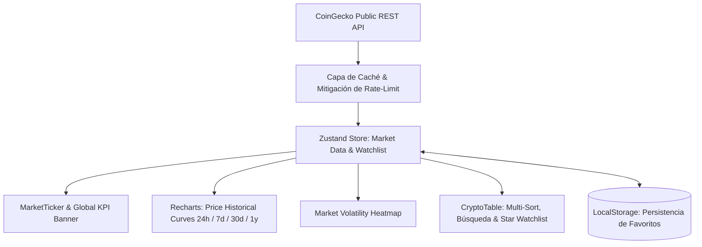

# CryptoFlow — Dashboard Financiero & Criptomonedas en Tiempo Real

<div align="center">


**Terminal bursátil web de alto rendimiento para el seguimiento y análisis técnico de criptoactivos en tiempo real con datos de CoinGecko API, gráficos interactivos Recharts y estado persistente con Zustand.**

[🚀 Demo en Vivo](https://alxnrocha.github.io/crypto-dashboard/) • [📂 Repositorio en GitHub](https://github.com/alxnrocha/crypto-dashboard)

</div>

---

## 🏛️ Arquitectura y Flujo de Datos


```mermaid
graph TD
    CoinGecko[CoinGecko Public REST API] --> Cache[Capa de Caché & Mitigación de Rate-Limit]
    Cache --> Store[Zustand Store: Market Data & Watchlist]
    Store --> Header[MarketTicker & Global KPI Banner]
    Store --> Chart[Recharts: Price Historical Curves 24h / 7d / 30d / 1y]
    Store --> Heatmap[Market Volatility Heatmap]
    Store --> Table[CryptoTable: Multi-Sort, Búsqueda & Star Watchlist]
    Store <--> LocalStorage[(LocalStorage: Persistencia de Favoritos)]
```

---

## ✨ Características Principales

- **Integración con CoinGecko API:** Consumo de datos de mercado del top 100 de criptoactivos con fallback offline inmediato.
- **Mitigación Inteligente de Rate-Limit:** Cacheo optimizado y polling controlado para evitar bloqueos por cuota de peticiones.
- **Motor de Fluctuación en Tiempo Real:** Algoritmo que simula micro-movimientos de mercado manteniendo la interfaz reactiva.
- **Gráficos Financieros Interactivos:** Visualización de curvas spline y volumen con Recharts y rangos temporales ajustables (24h, 7d, 30d, 1y).
- **Watchlist Persistente con Zustand:** Gestión de favoritos almacenada en el navegador para acceso inmediato.

---

## 🗂️ Estructura del Proyecto

```text
07-crypto-dashboard/
├── index.html
├── src/
│   ├── components/                # CryptoTable, PriceChart, MarketHeatmap, Watchlist
│   ├── services/                  # Integración CoinGecko API y caché
│   ├── stores/                    # Zustand store para estado global y favoritos
│   ├── types/                     # Tipos e interfaces TypeScript
│   ├── App.tsx                    # Componente raíz del dashboard
│   └── main.tsx                   # Punto de entrada React 19
├── package.json
├── tsconfig.json
└── vite.config.ts
```

---

## 🚀 Instalación y Puesta en Marcha

### Prerrequisitos
- Node.js `>= 20.0.0`
- npm `>= 10.0.0`

### Ejecución Local
```bash
# 1. Clonar el repositorio
git clone https://github.com/alxnrocha/crypto-dashboard.git
cd crypto-dashboard

# 2. Instalar dependencias
npm install

# 3. Iniciar servidor de desarrollo
npm run dev

# 4. Compilar para producción
npm run build
```

---

## 🛠️ Tecnologías Utilizadas

| Capa | Tecnología | Aspectos Clave |
|---|---|---|
| **Framework** | React 19 | Hooks modernos, arquitectura desacoplada por componentes |
| **Lenguaje** | TypeScript 5.8 | Tipado estricto para datos de mercado, endpoints y series de tiempo |
| **Estado Global** | Zustand 5.0 | Gestión reactiva de watchlist y cotizaciones en vivo |
| **Visualización** | Recharts 2.15 | Gráficos spline interactivos con tooltips formateados |
| **Estilos** | Tailwind CSS v4 | Tema Dark Terminal con micro-animaciones |
| **Despliegue** | GitHub Pages | Despliegue estático continuo y optimizado |

---

<div align="center">
  <sub>Desarrollado con dedicación por <a href="https://github.com/alxnrocha">Alex Rocha</a> • Proyecto 07 del Portafolio Profesional Frontend.</sub>
</div>
