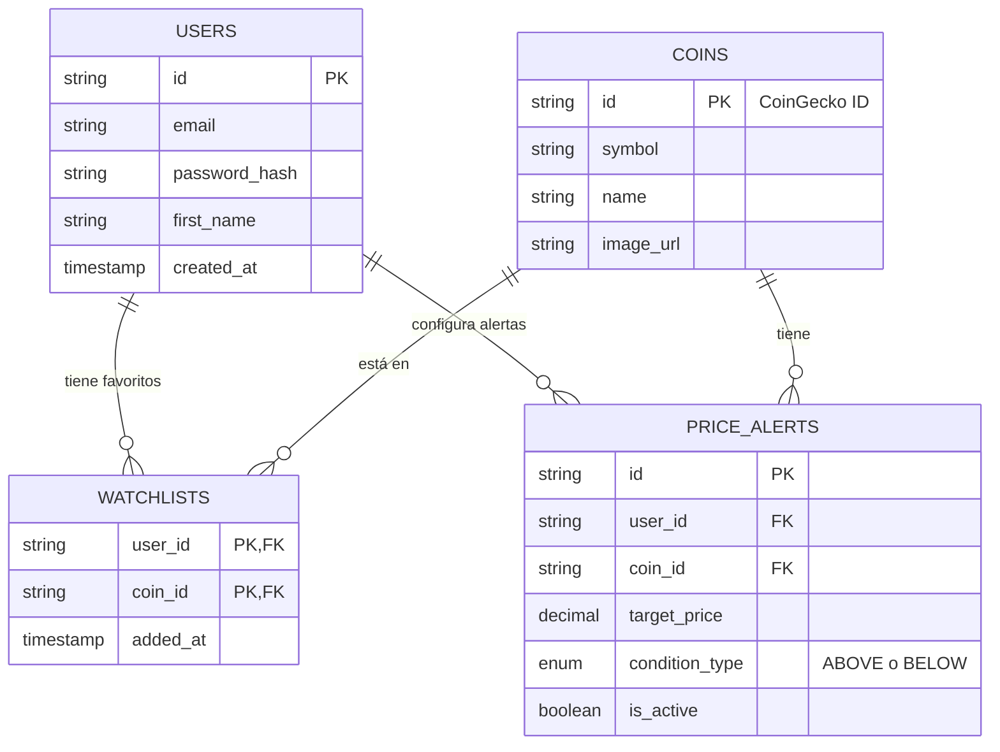

# Base de Datos: Crypto Dashboard

Este directorio contiene la arquitectura relacional (SQL) que soporta las funcionalidades de Watchlist y Alertas del Dashboard. 

Aunque el proyecto actual consume datos vía API (CoinGecko) y persiste favoritos en `localStorage`, este esquema demuestra cómo el producto será estructurado cuando migremos a un backend real en Node.js (con MySQL).

## Diagrama Entidad-Relación (DER)

El siguiente diagrama ilustra cómo las tablas se relacionan para soportar múltiples alertas y una lista de favoritos unificada por usuario.

## Ejecución

Para importar este modelo en su entorno local de MySQL Workbench:

1. Ejecute `schema.sql` para construir las tablas y restricciones (Foreign Keys).
2. Ejecute `seed.sql` para inyectar datos de prueba (Mock Users, Coins, Watchlist e Alerts).
